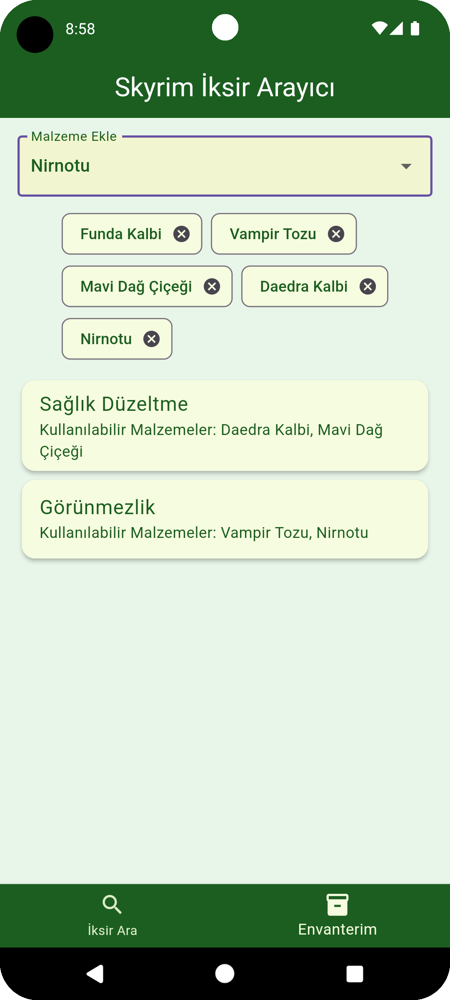
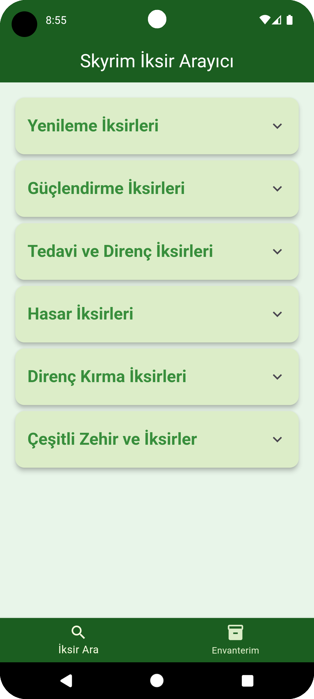

# 🧪 Skyrim Potion Finder

A fun and simple app to help you craft potions in Skyrim without flipping through menus or wikis.  
Search for potions, see required ingredients, and find out what you can craft with what you already have!

---

## 🌟 Features

- 🔍 **Potion Search:** Find potions and view required ingredients.
- 📦 **Inventory Check:** Add your ingredients and see what potions you can make.
- 🎨 **Skyrim-Themed Design:** Simple, clean, and immersive.

---

## 📸 Screenshots

| Potion Search | Inventory | Categories |
|---------------|-----------|------------|
|  |  |  |

---

## 🚀 Installation

Run the following commands to set up the app:

```bash
# Clone the repository
git clone https://github.com/yourusername/skyrim-potion-finder.git
cd skyrim-potion-finder

# Install dependencies
flutter pub get

# Run the app
flutter run
🤝 Contributing
Got an idea to make the app better? Contributions are welcome!

Fork the repository.
Create a new branch: git checkout -b feature-name
Make your changes and commit: git commit -m 'Add new feature'
Push and open a pull request.
📜 License
This project is licensed under the MIT License.
Feel free to use, modify, and share it!

🎮 Spend less time searching for ingredients and more time adventuring in Skyrim!